# A2A Multi-Agent System

**Knowledge Base + Database Query Orchestration — Built on Google's Agent-to-Agent (A2A) Protocol**


---

## Table of Contents

1. [Project Overview](#1-project-overview)
2. [System Architecture](#2-system-architecture)
3. [Agent Reference](#3-agent-reference)
   - [LLM Gateway Agent](#31-llm-gateway-agent--port-8003)
   - [KB Reader Agent](#32-kb-reader-agent--port-8001)
   - [DB Reader Agent](#33-db-reader-agent--port-8002)
   - [Orchestrator Agent](#34-orchestrator-agent--port-8000)
4. [Step-by-Step Setup Guide](#4-step-by-step-setup-guide)
5. [Service Reference](#5-service-reference)
6. [Troubleshooting](#6-troubleshooting)
7. [Performance Notes](#7-performance-notes)
8. [Demo Video](#8-demo-video)
---

## 1. Project Overview

This project implements a multi-agent AI system that lets users ask natural-language questions and receive intelligent answers drawn from two separate data sources: a **vector knowledge base** (Qdrant) and a **relational database** (PostgreSQL). All agents communicate exclusively using [Google's Agent-to-Agent (A2A) JSON-RPC protocol](https://google.github.io/A2A/), making every component independently deployable, observable, and replaceable.

The system follows a clean separation-of-concerns architecture. No agent holds business logic that belongs to another — the LLM Gateway is the sole point of model access, the KB and DB agents own their data retrieval, and the Orchestrator owns routing and synthesis without performing either directly.

### Key Design Principles

- **Single responsibility per agent** — each service does exactly one job
- **Zero direct LLM calls** in KB, DB, or Orchestrator agents — all inference delegates to `llm_agent`
- **Timeout ladder** — every outer layer timeout exceeds the layer below it
- **Keyword fast-path + route cache** — LLM routing only fires for ambiguous queries
- **Speculative parallel execution** — KB and DB are called in parallel while routing is pending

### Google A2A Protocol

Every inter-agent call is a JSON-RPC 2.0 `POST` to the recipient's root endpoint (`/`). Agents expose a discovery card at `/.well-known/agent.json` describing their name, description, skills, and capabilities. The `A2AClient` pools HTTP connections across calls and wraps all network errors into typed `FAILED` Task objects so no exception ever propagates to the caller.

| Property | Value |
|---|---|
| Protocol | JSON-RPC 2.0 over HTTP (Google A2A spec) |
| Discovery | `GET /.well-known/agent.json` |
| Task method | `POST /` → `tasks/send` |
| State machine | `submitted` \| `working` \| `completed` \| `failed` \| `canceled` |
| Artifacts | `TextPart` and `DataPart` within each Task response |

---

## 2. System Architecture

### Request Flow

```
Browser / Demo UI  (port 8080)
         │
         │  A2A tasks/send
         ▼
Orchestrator Agent  (port 8000)
  ├── Level 1: Route Cache
  ├── Level 2: Keyword Fast-Path
  └── Level 3: LLM Routing via llm_agent + Speculative Parallel Execution
         │
    ┌────┴────────────────────┐
    │                         │
    ▼  route=kb               ▼  route=db
KB Agent (8001)          DB Agent (8002)
    │                         │
    │  A2A tasks/send          │  A2A tasks/send (×2)
    └──────────┬──────────────┘
               ▼
        LLM Gateway Agent (8003)
        [AsyncOpenAI → LiteLLM → Ollama]
               │
    ┌──────────┴──────────┐
    ▼                     ▼
Qdrant (6333)        PostgreSQL (5432)
```

### Agent Responsibilities

| Agent | Owns | Delegates to llm_agent |
|---|---|---|
| `llm_agent :8003` | AsyncOpenAI call, think-block stripping, retry logic, token budgets | — (this IS the LLM layer) |
| `kb_agent :8001` | Qdrant embed + vector search, file listing, score threshold filtering | Synthesis of retrieved chunks |
| `db_agent :8002` | SQL safety check, psycopg2 execution, row serialisation | SQL generation + result summarisation |
| `orchestrator :8000` | Keyword routing, route cache, speculative parallel calls, final answer assembly | Routing decisions + multi-agent synthesis |

### Timeout Ladder

Every layer's timeout must be **greater** than the layer beneath it. This ensures the outer caller always receives a typed error response instead of a raw TCP reset.

| Layer | Timeout (CPU default) | Purpose |
|---|---|---|
| `LLM_READ_TIMEOUT_SECS` | 300 s | Single Ollama inference call inside `llm_agent` |
| `AGENT_READ_TIMEOUT_SECS` | 600 s | Full `kb`/`db` agent call (includes LLM round-trip) |
| `ROUTE_TIMEOUT_SECS` | 180 s | LLM routing decision in orchestrator (short reply) |
| `TEST_TIMEOUT_SECS` | 700 s | End-to-end test client timeout |

> All timeouts are configurable via environment variables. Once a GPU or remote LLM is introduced, all values can be reduced significantly.

---

## 3. Agent Reference

### 3.1 LLM Gateway Agent  (port 8003)

The LLM Gateway is the **sole point of contact** with the underlying language model (served via LiteLLM + Ollama). All other agents delegate inference here via A2A. This means model selection, token budgets, and retry logic are centralised in one place.

#### Skills

| Skill ID | Description |
|---|---|
| `route_question` | Decide which data agent(s) to call — returns `kb`, `db`, or `both` |
| `synthesise_kb` | Generate a plain-English answer from Qdrant search hits |
| `generate_sql` | Translate a natural-language question into a PostgreSQL SELECT |
| `summarise_db` | Summarise SQL query results in plain English |
| `synthesise_final` | Blend KB and DB answers into one coherent response |

#### Reasoning-Model Handling

Qwen3 and similar reasoning models wrap all output in `<think>...</think>` blocks. The agent handles this with three recovery strategies:

1. **Strip think-blocks** from the raw response and return the visible content
2. **Retry with 2× token budget** if result is empty and `finish_reason` is `length`
3. **Extract last word from think-block** as a fallback — works for single-word routing decisions like `kb` or `db`

---

### 3.2 KB Reader Agent  (port 8001)

The Knowledge Base agent performs semantic similarity search over documents indexed in Qdrant. It embeds the user's query using the configured embedding model, retrieves the top-k most similar chunks, filters by a score threshold of `0.50`, and delegates synthesis to `llm_agent`.

#### Request Flow

1. Receive natural-language question from orchestrator
2. If query contains `list` / `available` / `what files` keywords → call `list_knowledge_base_files()` and return immediately
3. Otherwise: embed query via LiteLLM embedding model
4. Query Qdrant collection with cosine similarity, `top_k` results (default: 3, max: 50)
5. Filter hits where `score >= 0.50`
6. Build context string from ranked hits (`rank`, `file_name`, `score`, chunk text)
7. Delegate synthesis to `llm_agent` with `SYNTH_SYSTEM` prompt
8. Return synthesised answer with sources cited

#### Configuration

| Variable | Default | Description |
|---|---|---|
| `QDRANT_HOST` | `localhost` | Qdrant service hostname |
| `QDRANT_PORT` | `6333` | Qdrant port |
| `QDRANT_COLLECTION` | `documents` | Collection name |
| `QDRANT_TEXT_KEY` | `text` | Payload key holding chunk text |
| `QDRANT_MAX_TOP_K` | `50` | Hard cap on `top_k` |
| `LITELLM_EMBEDDING_MODEL` | `qwen3-embedding:0.6b` | Embedding model name |

> **Text Key Note:** If your ingestion pipeline stores chunks under a different key (`content`, `page_content`, `chunk_text`, etc.), set `QDRANT_TEXT_KEY` in your environment. The agent also auto-falls back through: `content` → `page_content` → `chunk_text` → `body` → `passage` → `chunk_preview`. If none match, the actual payload keys are logged so you can configure the correct value.

---

### 3.3 DB Reader Agent  (port 8002)

The Database Reader agent translates natural-language questions into PostgreSQL `SELECT` statements, executes them safely against the configured database, and returns a plain-English summary. All LLM work (SQL generation and result summarisation) is delegated to `llm_agent`.

#### Request Flow

1. Receive natural-language question from orchestrator
2. Delegate SQL generation to `llm_agent` (skill: `generate_sql`) with full schema context
3. Extract `SELECT` statement from LLM response (strips think-blocks, markdown fences, preamble)
4. Safety check: only `SELECT` allowed; destructive keywords (`INSERT`, `UPDATE`, `DELETE`, `DROP`, etc.) are rejected
5. Execute query via `psycopg2` with `RealDictCursor`, fetch up to 50 rows
6. Delegate result summarisation to `llm_agent` (skill: `summarise_db`) with question + SQL + JSON rows
7. Return plain-English answer; fall back to raw row dump if `llm_agent` fails

#### Database Schema

| Property | Value |
|---|---|
| Table | `customer_transactions` (public schema — no prefix needed) |
| Columns | `CustomerID`, `Name`, `Surname`, `Gender`, `Birthdate`, `TransactionAmount`, `Date`, `MerchantName`, `Category` |
| Row limit | `LIMIT 50` enforced on every query |
| Safety | Only `SELECT`; destructive DML/DDL is rejected before execution |

#### Configuration

| Variable | Default | Description |
|---|---|---|
| `DB_HOST` | `localhost` | PostgreSQL hostname |
| `DB_PORT` | `5432` | PostgreSQL port |
| `DB_NAME` | `DEMODB` | Database name |
| `DB_USER` | `postgres` | Database user |
| `DB_PASSWORD` | `postgres` | Database password |
| `DB_CONNECTION_STRING` | — | Full DSN (overrides individual settings if set) |

---

### 3.4 Orchestrator Agent  (port 8000)

The Orchestrator is the entry point for all user queries. It performs **no inference directly** — it routes questions to the right specialist agents and synthesises their answers via `llm_agent`.

#### Routing Strategy — Three-Level Cascade

**Level 1 — Route Cache**

If the same question (case-insensitive) was answered within the last 300 seconds, the cached route is reused immediately. Cache holds up to 500 entries with LRU eviction.

**Level 2 — Keyword Fast-Path**

Compiled regex patterns detect strong signals for DB-type queries (`count`, `total`, `average`, `transaction`, `spend`, `revenue`, `top N`, etc.) and KB-type queries (`what is`, `explain`, `define`, `research`, `paper`, `knowledge base`, etc.). If only one pattern fires, the route is decided without any LLM call.

**Level 3 — LLM Routing with Speculative Execution**

For ambiguous queries, KB and DB agents are launched **in parallel** (speculative) while `llm_agent` makes the routing decision concurrently. Once the route is known, the unnecessary agent task is cancelled. If routing times out, `both` is used as a safe default.

#### Synthesis

When both agents contribute answers, a final `llm_agent` call blends them into a single coherent response using the `synthesise_final` skill. When only one agent contributed, its answer is returned directly — no extra LLM round-trip.

---

## 4. Step-by-Step Setup Guide

### 4.1 Prerequisites

- Docker Engine 24+ and Docker Compose V2 (`docker compose` — not `docker-compose`)
- At least 8 GB RAM available to Docker (16 GB recommended for local Ollama)
- Ollama installed locally or a remote LiteLLM-compatible endpoint
- Python 3.11+ (for the test suite only — agents run inside Docker)
- The `demo-net` Docker network must exist before `compose up`

---

### 4.2 Step 1 — Clone Repo

Clone this repo and perform sync to download necessary python packages.

```bash
# Clone Repo
git clone https://github.com/tdtheautomator/ai-a2a.git

# Sync Python Libraries
uv sync
```

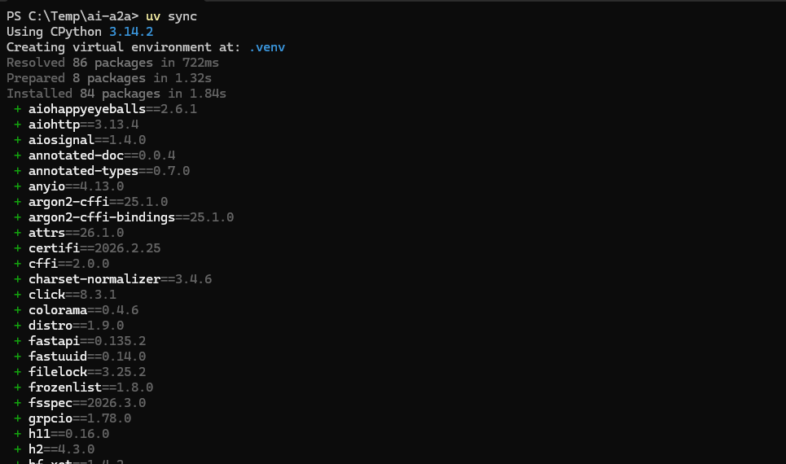


### 4.3 Step 2 — Start Infrastructure Services

Start infrastructure services.

```bash
# Change Directory
cd 01.pre

# Start Core Infra Serivces
docker compose -f docker-compose-infra.yaml up -d
```

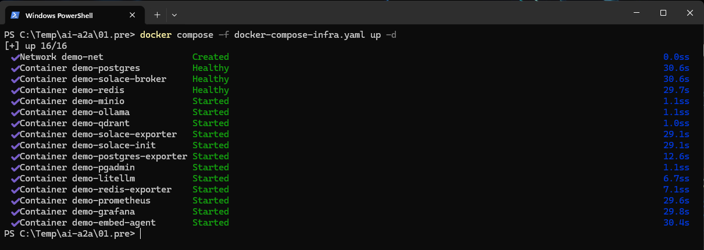

---

### 4.4 Step 3 — Ingest PDFs

Upload documents to minio which which will be picked by embed-agent

```bash
# Open Logs Terminal
docker compose -f docker-compose-infra.yaml logs ollama embed-agent --follow

# Upload files
uv run .\scripts\upload_file.py .\docs\2601.03236v1.pdf
uv run .\scripts\upload_file.py .\docs\2601.02813v2.pdf
uv run .\scripts\upload_file.py .\docs\2602.00307v2.pdf
uv run .\scripts\upload_file.py .\docs\2602.00751v1.pdf
```

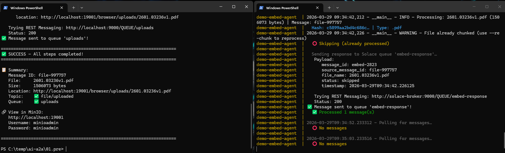

---

### 4.5 Step 4 - Ingest Customer Transactions

Upload Customer transactions into posgresh sql database.

```bash
uv run .\scripts\import_customer_transactions.py
```

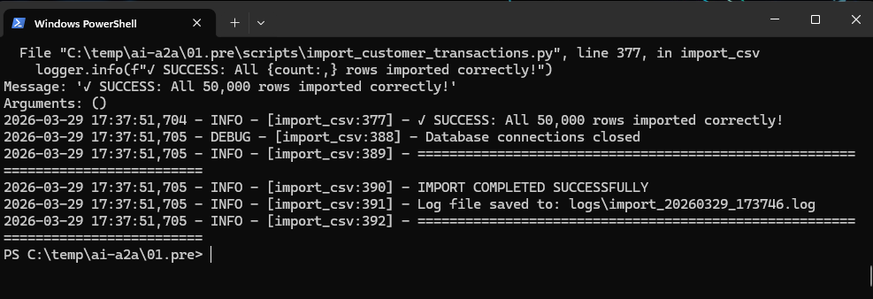

### 4.6 Step 5 - Shutdown Un Necessary Containers (Optional)

To save resources lets shutdown resources which are not needed.

```bash
docker compose -f docker-compose-infra.yaml down solace-init embed-agent solace-broker minio postgres-exporter redis-exporter solace-exporter grafana prometheus pgadmin
```
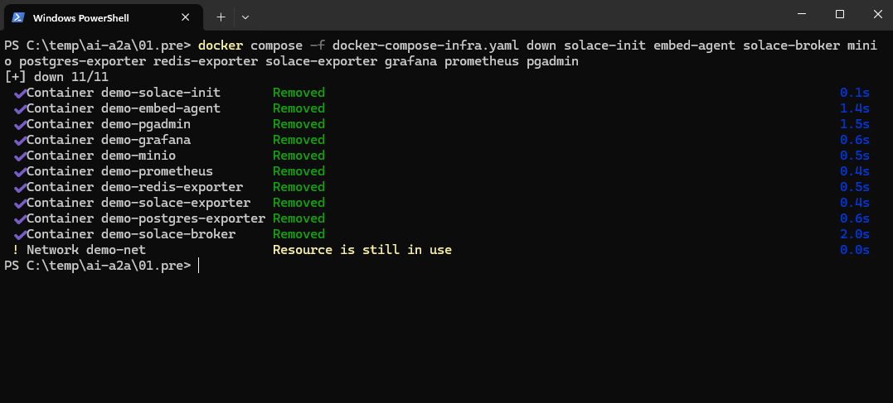

### 4.7 Step 6 - Start Agents

Now all the agents and ui containers can be started.

```bash
#Change Directory
cd ..\02.agents\

#Build Images
docker compose -f docker-compose-agents.yaml build --no-cache
```

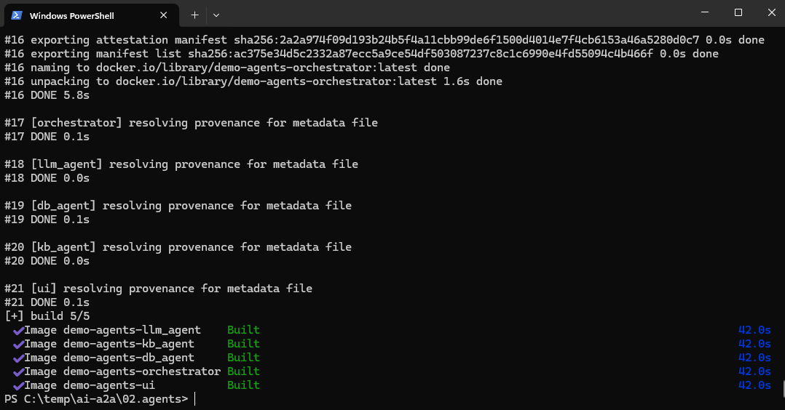

```bash
#Start Agents
docker compose -f docker-compose-agents.yaml up -d
```

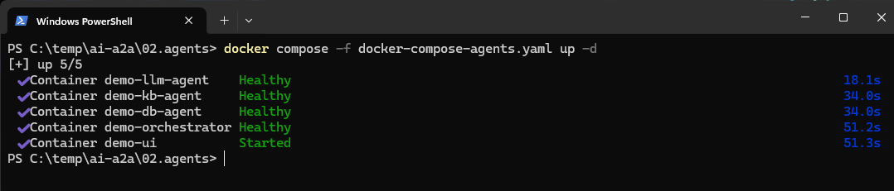

### 4.8 Step 7 - A2A Demo

All the reosurces are spinned, follow the steps to see it in action.

#### Launch UI

Open --> [http://localhost:8080]

#### Agent Cards

Navigate to agents to see Agent Cards
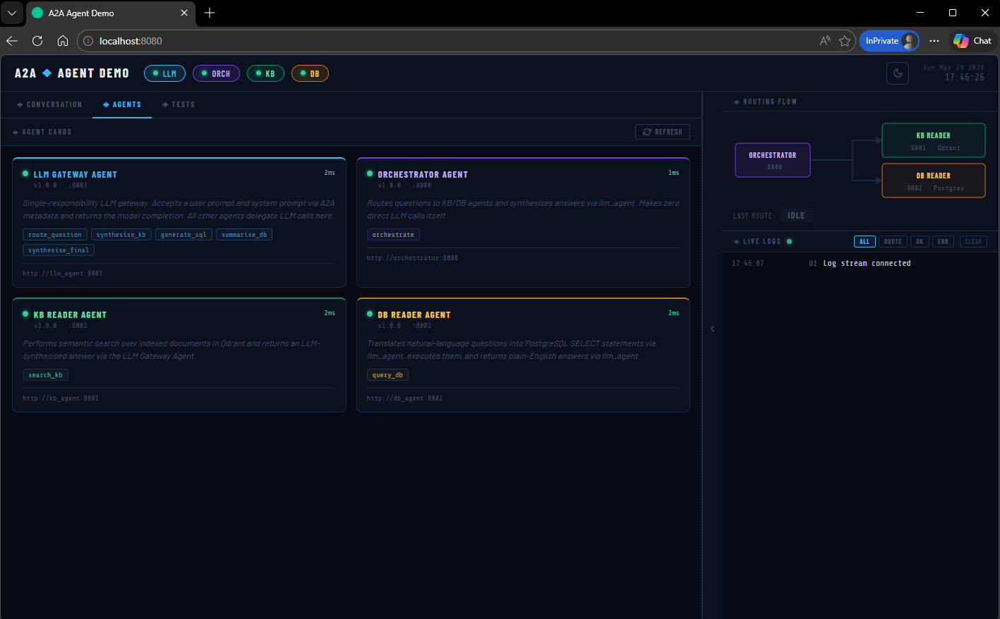

#### Tests

The project comes with built-in tests, use them to validate.

##### Health

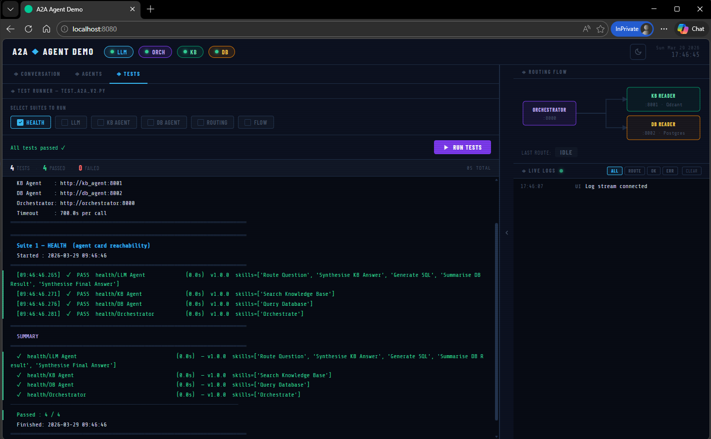

##### LLM

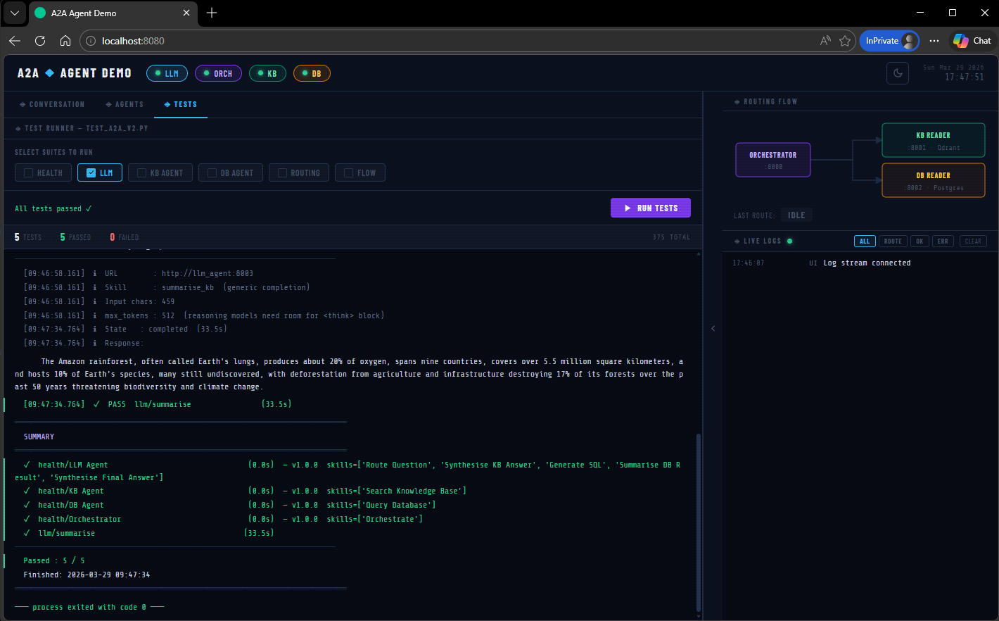

##### Routing

Here we can see the expected routing and actual routing.
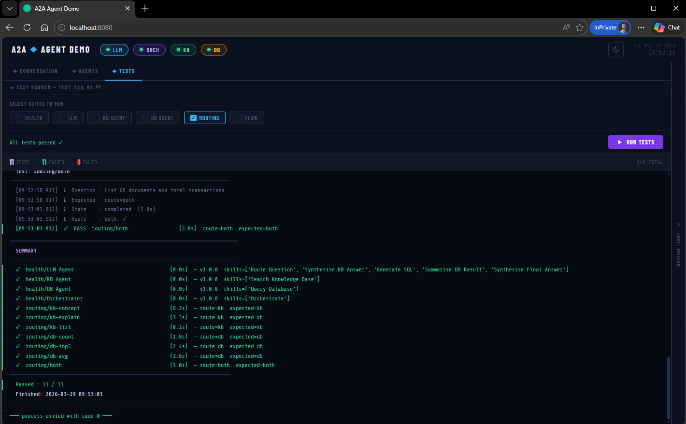

### Conversastions
Use this tab to see the A2A Demo

| 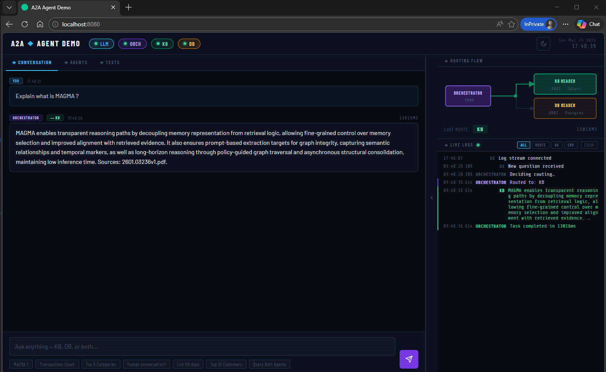   |      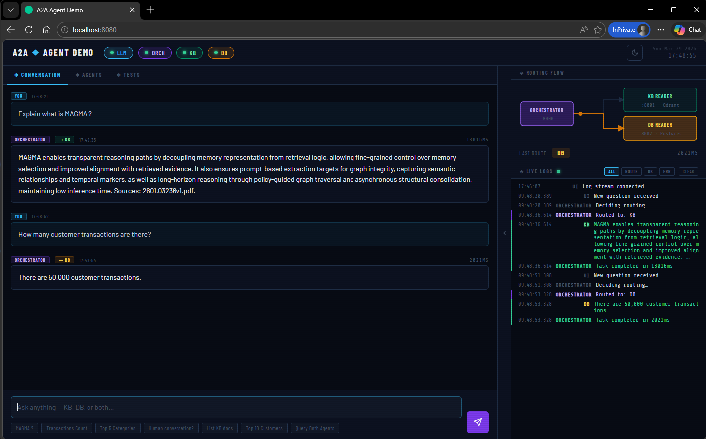      |
|----------|:-------------:|
|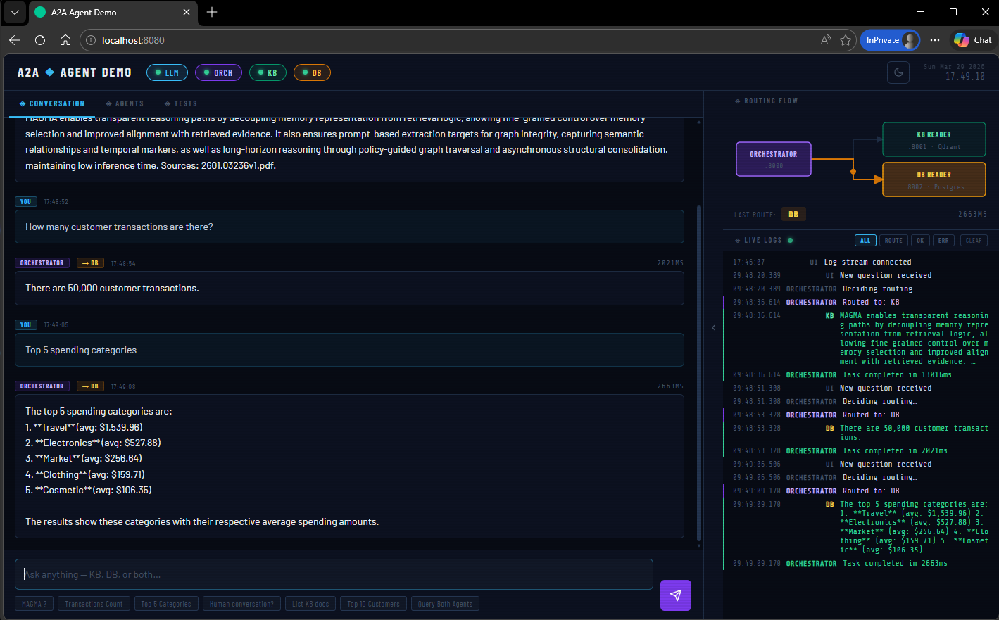 |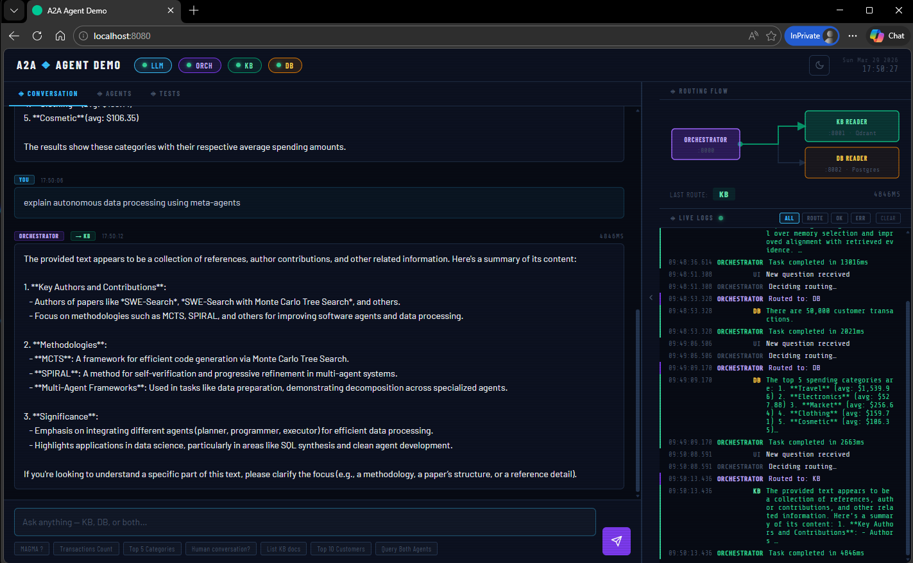 |
|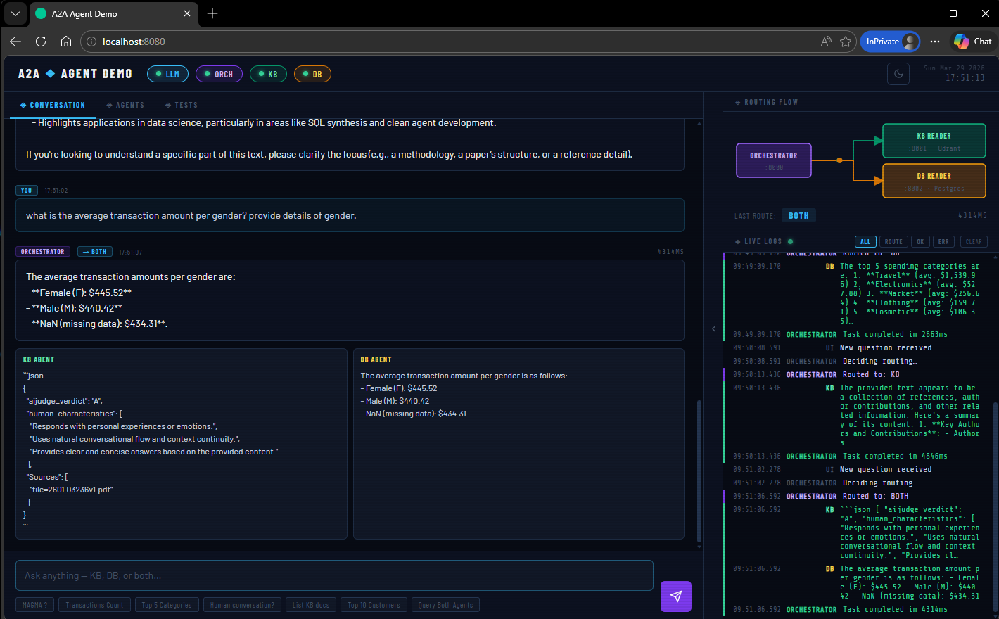 |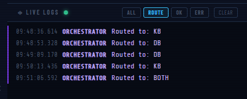 |


### Step 5 — Configure Environment (Optional)

All agent configuration is managed via the `x-agent-env` block in `docker-compose-agents.yaml`. Review and update these variables for your environmentif needed:

| Variable | Default | Description |
|---|---|---|
| `LITELLM_HOST` | `demo-litellm` | LiteLLM proxy hostname |
| `LITELLM_CHAT_MODEL` | `qwen3:0.6b` | Chat/completion model name |
| `LITELLM_EMBEDDING_MODEL` | `qwen3-embedding:0.6b` | Embedding model name |
| `QDRANT_COLLECTION` | `documents` | Qdrant collection to search |
| `DB_NAME` | `DEMODB` | PostgreSQL database name |
| `DB_PASSWORD` | `postgres` | **Change this in production!** |
| `LLM_READ_TIMEOUT_SECS` | `300` | Single LLM call timeout (lower with GPU) |
| `AGENT_READ_TIMEOUT_SECS` | `600` | Full agent call timeout |
| `ROUTE_TIMEOUT_SECS` | `180` | Routing decision timeout |

---

## 5. Service Reference

### 5.1 Port Map

| Container | Port | Health Check | Role |
|---|---|---|---|
| `demo-llm-agent` | `8003` | `/.well-known/agent.json` | LLM Gateway (Ollama/LiteLLM proxy) |
| `demo-kb-agent` | `8001` | `/.well-known/agent.json` | Qdrant semantic search |
| `demo-db-agent` | `8002` | `/.well-known/agent.json` | PostgreSQL query execution |
| `demo-orchestrator` | `8000` | `/.well-known/agent.json` | Routing and synthesis |
| `demo-ui` | `8080` | `HTTP GET /` | Demo web interface |
| `demo-qdrant` | `6333` | — | Vector store (external) |
| `demo-postgres` | `5432` | — | Relational DB (external) |
| `demo-litellm` | `4000` | — | LLM proxy / gateway (external) |

### 5.2 File Structure

```
├── a2a/
│   ├── protocol.py          # A2A Pydantic models (Task, Message, Artifact, AgentCard, JSON-RPC)
│   └── client.py            # Async HTTP A2A client with connection pooling and error wrapping
├── agents/
│   ├── base.py              # BaseA2AAgent — FastAPI app, route registration, helpers
│   ├── llm_agent.py         # LLM Gateway — AsyncOpenAI, think-block stripping, retry logic
│   ├── kb_agent.py          # KB Reader — Qdrant search, file listing, synthesis delegation
│   ├── db_agent.py          # DB Reader — SQL generation, psycopg2 execution, summarisation
│   └── orchestrator.py      # Orchestrator — keyword routing, cache, speculative execution
├── src/
│   ├── kb/
│   │   └── kb_tools.py      # Qdrant helper functions (embed, search, list, text extraction)
│   └── db/
│       └── db_tools.py      # PostgreSQL helpers (connect, safety check, execute, extract SQL)
├── tests/                   # End-to-end test suite
├── docker-compose-agents.yaml
└── Dockerfile
```

---

## 6. Troubleshooting

| Symptom | Resolution |
|---|---|
| Agent card returns 503 | Container not healthy — check `docker compose ps` and `docker logs <container>` |
| Empty LLM reply, `skill=route_question` | Model uses all tokens on thinking. Raise `ROUTE_MIN_TOKENS` (default `256`) or switch to a non-reasoning model |
| `ReadTimeout` from orchestrator | Ollama inference slower than `AGENT_READ_TIMEOUT_SECS`. Raise timeout or add GPU. See timeout ladder in Section 2 |
| No KB results (score < 0.50) | Documents may not be indexed, or `QDRANT_TEXT_KEY` is wrong. Check `kb_agent` logs for `Actual keys` warning |
| SQL returned is not a SELECT | LLM produced preamble or markdown. `db_agent` strips fences and think-blocks; if still failing, raise `db_agent` `max_tokens` |
| `CONNECT_FAIL` in A2AClient | Wrong container hostname or service not on `demo-net`. Verify `docker network inspect demo-net` and check compose service names |
| Route always returns `both` | LLM routing timed out. Raise `ROUTE_TIMEOUT_SECS` or verify Ollama is running and reachable from the orchestrator container |
| DB error: column not found | PostgreSQL column names are case-sensitive. Always double-quote columns (e.g., `"TransactionAmount"`) in generated SQL |

---

## 7. Performance Notes

The default configuration targets CPU-only Ollama environments using Qwen3 0.6B, which produces approximately 0.06 tokens/second (~50 seconds per 3 tokens). All timeout defaults are calibrated for this worst case.

| Operation | CPU-Only | With GPU | Variable to Tune |
|---|---|---|---|
| Route decision (short reply) | 60–120 s | 1–5 s | `ROUTE_TIMEOUT_SECS` |
| SQL generation (512 tokens) | 120–250 s | 5–15 s | `LLM_READ_TIMEOUT_SECS` |
| KB synthesis (1000 tokens) | 150–300 s | 8–20 s | `AGENT_READ_TIMEOUT_SECS` |
| Full DB agent (2× LLM calls) | 240–500 s | 15–40 s | `AGENT_READ_TIMEOUT_SECS` |
| End-to-end (both agents) | 300–600 s | 20–60 s | `TEST_TIMEOUT_SECS` |

To improve performance:
1. Switch to a GPU-backed Ollama instance or a hosted API via LiteLLM
2. Use a smaller, faster model for routing only (routing only needs `kb`/`db`/`both` as output)
3. Rely on the keyword fast-path — it bypasses LLM routing entirely for common query patterns

---

## 8. Demo Video


*A2A Multi-Agent System — Built with [Google A2A Protocol](https://google.github.io/A2A/)*
